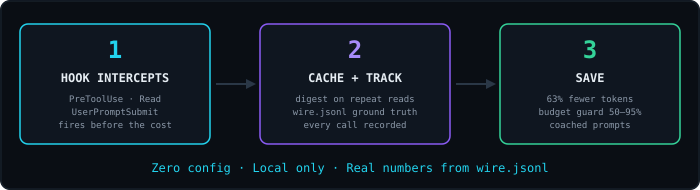
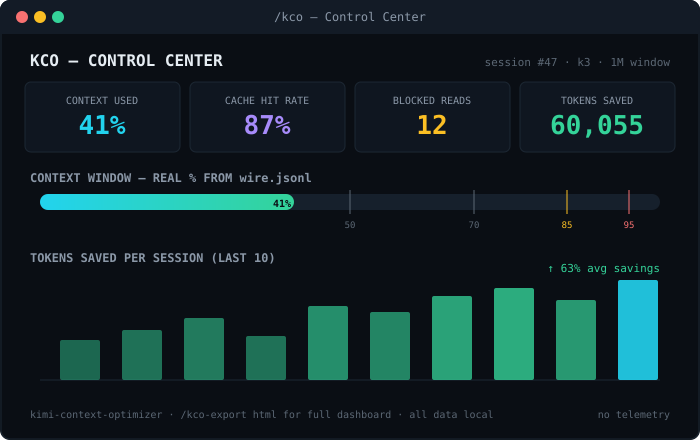

<p align="center">
  
</p>

<p align="center">
  <strong>Stop burning context on redundant reads and weak prompts.</strong><br/>
  <sub>Real per-step context size from wire.jsonl — window-aware for K2.7 (256K) and K3 (1M), zero config.</sub>
</p>

<p align="center">
  <a href="#install"></a>
  <a href="LICENSE"></a>
  
  
  
  
</p>

<p align="center">
  <a href="#install"><strong>Install</strong></a> ·
  <a href="https://&lt;user&gt;.github.io/kimi-context-optimizer/"><strong>Landing page</strong></a> ·
  <a href="#all-commands"><strong>Commands</strong></a> ·
  <a href="#why-the-kimi-version-is-better"><strong>Why better</strong></a>
</p>

---

## See it in action

<p align="center">
  
</p>

This is a real flow, not a mock-up: the second `Read` of the same file gets
**blocked**, the agent receives a compact structural map instead of the whole
file again, and the session ends with an honest savings number measured
against the wire transcript.

## The problem

The average agentic session **wastes 30–50% of its context** on things that
never influence a single edit:

- The same file read twice? **Full price, twice.**
- A 2,000-line module read to change one function? **~18K tokens for a 40-token job.**
- `npm test` dumping 40K tokens of output into context? **It stays there all session.**
- A vague prompt that sends the agent exploring instead of editing? **Every retry re-sends the entire conversation.**

You pay for waste twice: once in tokens, once in quality — the useful context
gets crowded out long before the window is full.

## The solution

KCO hooks into the Kimi Code lifecycle and quietly fixes this. **Install &
forget** — it works from the first tool call:

```bash
/plugins install https://github.com/<you>/kimi-context-optimizer
/reload
```

<p align="center">
  
</p>

## What's new in v1.0 — the Kimi-native port

KCO is a full port of **claude-context-optimizer** — rebuilt on Kimi Code's
surface, where the data is *better*:

- **Budget guard on ground truth.** The context budget reads the exact
  per-step usage from the session's `wire.jsonl`
  (`inputOther` + `inputCacheRead` + `inputCacheCreation`) — not estimates.
  Estimates still exist as a fallback and self-calibrate against the wire
  data over time (EMA, clamped).
- **Real cache economics.** The wire transcript reports cache reads and
  cache creation per step, so the dashboard shows your actual cache hit rate
  and names every cache break — no provider-specific multiplier math.
- **Failure tracking.** `PostToolUseFailure` turns failed/blocked tool calls
  into a session health signal. Three failures of the same tool → one
  targeted usage hint, once per session.
- **Delegation attribution.** `SubagentStart`/`SubagentStop` events record
  every delegation — you see what fanned-out work actually costs, no
  process-ID guessing.
- **Window-aware budgets.** Effective budget caps to the active model's
  `max_context_size` from your own `config.toml` (256K on K2.7, 1M on K3) —
  plus a one-shot **context-rot warning** at ~350K on 1M-window models,
  where quality degrades long before the window fills.
- **Subscription-honest metrics.** Headline numbers are tokens and % of your
  window. Dollar figures appear only if you configure real prices — nothing
  assumes a billing model you may not have.

## Features

### Smart Read Cache — redundant reads, blocked

The second full read of an unchanged file never reaches the model. Instead it
gets a ~100-token structural map — imports, functions, classes, line numbers —
and a hint to use `offset/limit` for the section it actually needs:

```
⛔ [read-cache] Already loaded tracker.js this session (412 lines, ~3,900 tokens). File unchanged.
📋 File map (412 lines):
  1: import { saveCache } from './cache.js'
  42: export function recordCall(call)
  118: function estimateTokens(lines, ext)
  204: export function buildReport(session)
  … 8 more landmarks
```

Reads are re-allowed when the file changes on disk, when you request an
uncovered range, or when the cached entry goes stale. Honest accounting: a
full read of a 3-line file is counted as 3 lines, not the 1,000-line default.

### ContextShield — yesterday's waste becomes tomorrow's rule

Files that were read-but-never-used in 3+ sessions surface as warnings before
the read happens. Chronic waste becomes permanent with one command —
`/kco-shield apply` writes gitignore-style rules into `.contextignore`
(project) or `~/.kimi-code/.contextignore` (global).

### Budget guard — your real context %, live

<p align="center">
  
</p>

Every tool call updates the true context size from the wire transcript and
compares it against your actual model window. Warnings at 50/70/85/95%,
`/compact` nudges at 90%, cache-break cost notices after ≥5-minute pauses —
and any single tool result ≥10K tokens gets a one-line fix
("pipe through tail/grep", "read with offset/limit").

### Prompt Coach — grade every prompt before it runs

Every prompt is classified (chat / question / task) and graded S–F — in
English **and** Russian. Weak task prompts get sharpening hints injected
before the model ever sees them; "спасибо, всё ок" correctly gets left alone.
One precise prompt is cheaper than three vague ones — each retry re-sends
your whole context.

### Tracker & reports — real numbers, not vibes

Every tool call, file touch, failure, and delegation is recorded locally.
On top of that data: the `/kco` Control Center, cross-session ROI reports,
weekly efficiency digests with an S–F score, per-task token attribution,
HTML dashboard export, and session replay for picking up where you left off.

## All commands

| Command | What it does |
|---|---|
| `/kco` | Control Center — budget, savings, waste, prompt grade, next actions |
| `/kco-budget` | Set budget limits, auto-compact, optional pricing; window-aware |
| `/kco-report` | Full token ROI report across all sessions + file suggestions |
| `/kco-roi` | Monthly token savings projection (tokens-first, $ if priced) |
| `/kco-digest [days]` | Efficiency digest with S–F grade and trends |
| `/kco-export [md\|html]` | Export the report as Markdown or an HTML dashboard |
| `/kco-replay [N]` | Summaries of your last N sessions for quick context recovery |
| `/kco-task add/list/done` | Per-task token attribution — see what each task cost |
| `/kco-pack "<task>"` | Build a minimal, ranked context pack (files + offset/limit) for a task |
| `/kco-templates` | Save and re-apply named context sets for recurring task types |
| `/kco-git` | Suggest files to read from current git state + history |
| `/kco-anatomy` | One-file project map: every file with size, tokens, category |
| `/kco-shield [suggest\|apply]` | Waste-protection status; turn chronic waste into `.contextignore` rules |
| `/kco-agentsmd` | Audit AGENTS.md for token bloat, get concrete trims |
| `/kco-coach [text]` | Grade a prompt (or your recent ones) and offer a rewrite |
| `/kco-overhead` | Audit fixed per-session overhead (system prompt, plugins, skills) from the real wire transcript |
| `/kco-doctor` | Health check: versions, hooks, data dir, config, Node version |
| `/kco-clean` | Delete old tracking data / reset stats |
| `/kco-smart-loader` | Auto-suggests files to preload when you describe a new task |

## Hooks (automatic, zero config)

| Hook | What it does |
|---|---|
| `PreToolUse: Read` → read-cache | Blocks redundant full reads; serves a file digest on repeat reads |
| `PreToolUse: Read` → context-shield | Warns when a file was waste in 3+ past sessions; enforces `.contextignore` |
| `UserPromptSubmit` → prompt-coach | Grades your prompt (S–F, EN+RU) and suggests fixes before it runs |
| `PostToolUse` → tracker | Records every tool call, token estimate, and file touch |
| `PostToolUse` → budget | Shows **real context % from wire.jsonl**, warns at 50/70/85/95%, nudges `/compact` at 90% |
| `PostToolUseFailure` → tracker | Tracks failed tool calls as a session health signal |
| `SubagentStart/Stop` → tracker | Attributes tokens to sub-agent delegations |
| `PreCompact` / `PostCompact` | Snapshots cache + tracker state around compaction |
| `SessionStart/End` | Opens/closes the session record; prints the summary board on exit |

All hooks are **fail-open**: if a script errors or times out, Kimi Code just
carries on. KCO can never break your session.

## Why the Kimi version is better

| | claude-context-optimizer | **kimi-context-optimizer** |
|---|---|---|
| Context size | Estimated from tool payloads | **Exact per-step usage from `wire.jsonl`** |
| Cache economics | Modeled with provider multipliers | **Measured (`inputCacheRead`/`inputCacheCreation`)** |
| Failed tool calls | Invisible | **Tracked (`PostToolUseFailure`)** |
| Delegation cost | Process-ID heuristics | **`SubagentStart`/`SubagentStop` events** |
| Context window | Hardcoded model table | **Your `config.toml` (256K/1M), env override** |
| Metrics | $-first (API billing assumed) | **Tokens-first, $ optional (subscription-honest)** |
| Memory file | CLAUDE.md | **AGENTS.md (project + `~/.agents`)** |

## Install

Requires Kimi Code CLI and Node.js ≥ 18 on your `PATH` (hooks are plain
`node` scripts, zero npm dependencies).

```bash
# Option 1 — from a local checkout
/plugins install /path/to/kimi-context-optimizer

# Option 2 — straight from GitHub
/plugins install https://github.com/<you>/kimi-context-optimizer

# then
/reload
```

Verify with `/kco-doctor` — it checks the manifest, hook wiring, data dir,
model config, and wire-transcript access.

**Updating:** reinstall from the newer path/URL and `/reload` again.
`/plugins install` copies the plugin into Kimi's managed plugins directory —
editing the source checkout does not change the installed copy until you
reinstall (`kco-doctor` warns when they drift).

## Configuration

All optional. Defaults are sane out of the box.

`~/.kimi-context-optimizer/config.json`:

```json
{
  "budgetTokens": 200000,
  "warnAt": [50, 70, 85, 95],
  "autoCompactAt": 90,
  "pricePerMillionInput": null,
  "pricePerMillionOutput": null,
  "quiet": false
}
```

- `pricePerMillionInput/Output` — USD per 1M tokens. `null` (default) hides
  all cost features; set real numbers to see $ in the dashboard and reports.
- `quiet` — suppresses non-essential CLI output.

Environment variables:

- `KCO_HOME` — move the data directory (default `~/.kimi-context-optimizer/`).
- `KCO_CONTEXT_WINDOW` — override the context window from any source.

`.contextignore` — gitignore-style file list blocked from full reads.
Project level: `./.contextignore`; global: `~/.kimi-code/.contextignore`.
Start from [`.contextignore.example`](.contextignore.example), or let
`/kco-shield apply` grow it from your actual waste history.

## How it works

**Ground truth.** Kimi Code writes every session step to
`~/.kimi-code/sessions/wd_*/<session>/agents/main/wire.jsonl`, including exact
per-step token usage and cache fields. KCO reads that file (defensively —
unknown records are skipped) and treats it as the source of truth for context
size, cache hit rate, and model identity. When the wire file is unreachable,
estimation takes over and self-calibrates against real totals at session end.

**Token estimation.** Extension-aware chars-per-token ratios (~40 file types)
with an EMA calibration factor per codebase, clamped to 0.5–2.0. Tool outputs
are measured from the actual `tool_output` payload, not guessed from file
stats.

**Usefulness scoring.** At session end each file gets a score: edits ×3,
re-read and partial-read bonuses, penalties for re-reads that never led to an
edit. Score ≤ 0 → counted as waste. Waste rolls into cross-session patterns
that power ContextShield and the reports.

## Data & privacy

Everything lives locally under `~/.kimi-context-optimizer/` — session
records, patterns, templates, config. No telemetry, no network calls, nothing
leaves your machine. `/kco-clean --reset-all` wipes it all.

## Development

```bash
npm test                  # node --test tests/  (77 tests)
node benchmark/run.js     # token-savings proof: 63% across 7 scenarios
node src/doctor.js        # health check of the install
```

Structure:

```
kimi.plugin.json    plugin manifest (hooks + skills registration)
src/                26 zero-dependency ESM modules (hooks + CLIs)
skills/             19 /kco-* skills (thin wrappers over src CLIs)
agents/             context-analyzer sub-agent definition (reference)
docs/               landing page + hook protocol notes
assets/             logo and demo SVGs
benchmark/          reproducible savings scenarios + fixtures
tests/              node:test suite
scripts/            sync-version.js (keeps manifest/package.json in sync)
```

## Credits

Ported from **claude-context-optimizer** (MIT) by the CCO authors. Rebuilt
for Kimi Code's hook events, wire-transcript usage data, `config.toml` model
detection, and `AGENTS.md` conventions. License: MIT.
