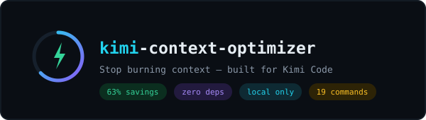
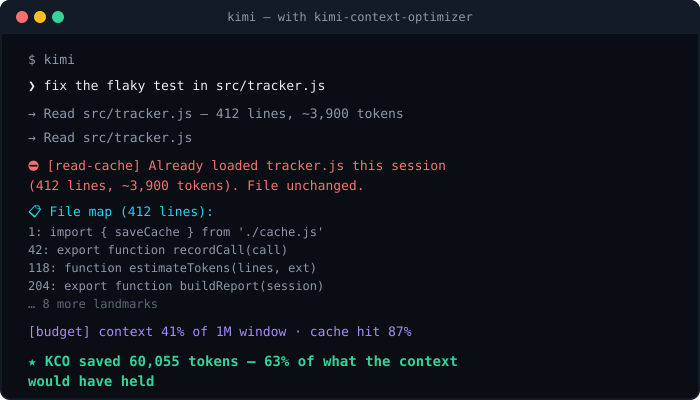

<p align="center">
  
</p>

<p align="center">
  <strong>Stop burning context on redundant reads and weak prompts. Built for Kimi Code.</strong><br/>
  <sub>Real per-step context size from wire.jsonl — window-aware for K2.7 (256K) and K3 (1M), zero config.</sub>
</p>

<p align="center">
  <a href="#install"></a>
  <a href="LICENSE"></a>
  
  
  
</p>

<p align="center">
  <a href="https://&lt;user&gt;.github.io/kimi-context-optimizer/"><strong>Landing page</strong></a>
</p>

---

KCO is a Kimi Code plugin that tracks how your sessions actually spend context,
blocks redundant file reads before they happen, guards your token budget with
**real** usage numbers, and coaches your prompts — all locally, no telemetry.

## See it in action

<p align="center">
  
</p>

## The problem

In a typical agentic session, 30–40% of context is waste: files read twice,
lockfiles opened in full, 2,000-line modules read to change one function, and
vague prompts that send the agent exploring instead of editing. You pay for
that waste twice — once in tokens, once in the quality drop when the useful
context gets crowded out.

## The solution

KCO hooks into the Kimi Code lifecycle and quietly fixes this:

- **Read Cache** — a second full read of the same file returns a compact
  structural digest instead of the whole file again.
- **ContextShield** — warns before you read files that were waste in past
  sessions, and turns chronic waste into permanent `.contextignore` rules.
- **Budget guard** — live % of your *actual* context window (read from the
  session's wire transcript, not estimated), with auto-compact nudges.
- **Prompt Coach** — grades every prompt (English + Russian) before it runs
  and tells you how to make it land on the first try.
- **Tracker** — every tool call, failure, and sub-agent delegation is recorded
  so reports, digests, and per-task costs are real, not vibes.

## Install

```bash
# from Kimi Code CLI
/plugins install /path/to/kimi-context-optimizer
# or
/plugins install https://github.com/<you>/kimi-context-optimizer
/reload
```

To update: reinstall from the newer path/URL and `/reload` again. Note that
`/plugins install` copies the plugin into Kimi's managed plugins directory —
editing the source checkout does not change the installed copy until you
reinstall.

Requires Node.js ≥ 18 on your `PATH` (hooks are plain `node` scripts).

## What you get

### Hooks (automatic, zero config)

| Hook | What it does |
|---|---|
| `PreToolUse: Read` → read-cache | Blocks redundant full reads; serves a file digest on repeat reads |
| `PreToolUse: Read` → context-shield | Warns when a file was waste in 3+ past sessions; enforces `.contextignore` |
| `UserPromptSubmit` → prompt-coach | Grades your prompt (S–F, EN+RU) and suggests fixes before it runs |
| `PostToolUse` → tracker | Records every tool call, token estimate, and file touch |
| `PostToolUse` → budget | Shows **real context % from wire.jsonl**, warns at 50/70/85/95%, nudges `/compact` at 90% |
| `PostToolUseFailure` → tracker | Tracks failed tool calls as a session health signal |
| `SubagentStart/Stop` → tracker | Attributes tokens to sub-agent delegations |
| `PreCompact` / `PostCompact` | Snapshots cache + tracker state around compaction |
| `SessionStart/End` | Opens/closes the session record; prints the summary board on exit |

### Skills (`/kco-*` commands)

| Command | What it does |
|---|---|
| `/kco` | Control Center — budget, savings, waste, prompt grade, active task, next actions |
| `/kco-budget` | Set budget limits, auto-compact, optional pricing; window-aware |
| `/kco-report` | Full token ROI report across all sessions + file suggestions |
| `/kco-roi` | Monthly token savings projection (tokens-first, $ if priced) |
| `/kco-digest [days]` | Efficiency digest with S–F grade and trends |
| `/kco-export [md\|html]` | Export the report as Markdown or an HTML dashboard |
| `/kco-replay [N]` | Summaries of your last N sessions for quick context recovery |
| `/kco-task add/list/done` | Per-task token attribution — see what each task cost |
| `/kco-pack "<task>"` | Build a minimal, ranked context pack (files + offset/limit) for a task |
| `/kco-templates` | Save and re-apply named context sets for recurring task types |
| `/kco-git` | Suggest files to read from current git state + history |
| `/kco-anatomy` | One-file project map: every file with size, tokens, category |
| `/kco-shield [suggest\|apply]` | Waste-protection status; turn chronic waste into `.contextignore` rules |
| `/kco-agentsmd` | Audit AGENTS.md for token bloat, get concrete trims |
| `/kco-coach [text]` | Grade a prompt (or your recent ones) and offer a rewrite |
| `/kco-overhead` | Audit fixed per-session overhead (system prompt, plugins, skills) from the real wire transcript |
| `/kco-doctor` | Health check: versions, hooks, data dir, config, Node version |
| `/kco-clean` | Delete old tracking data / reset stats |
| `/kco-smart-loader` | Auto-suggests files to preload when you describe a new task |

## Why the Kimi version is better

KCO is a port of [claude-context-optimizer](https://github.com/) (CCO), but the
Kimi Code surface lets it be *more honest*:

- **Real per-step context size from `wire.jsonl`** — the budget guard reads the
  exact context token count of every API step instead of estimating from tool
  payloads. Estimates are only a fallback and self-calibrate against the wire
  data over time.
- **Real cache economics** — the wire transcript reports `inputCacheRead` and
  `inputCacheCreation` per step, so cache hits and re-writes are measured, not
  modeled.
- **PostToolUseFailure tracking** — failed tool calls are recorded as a session
  health signal on the dashboard.
- **SubagentStart/Stop tracking** — sub-agent delegations are attributed, so you
  see what delegated work actually costs.
- **Window-aware budgets from your actual `config.toml`** — the effective
  budget caps to the active model's `max_context_size` (256K default, 1M on k3)
  instead of a hardcoded model table. `KCO_CONTEXT_WINDOW` overrides it.
- **Subscription-honest metrics** — primary numbers are tokens and % of your
  window. Dollar figures appear only if you configure real prices; nothing
  assumes a per-token billing model you may not have.

## Configuration

All optional. Defaults are sane out of the box.

`~/.kimi-context-optimizer/config.json`:

```json
{
  "budgetTokens": 200000,
  "warnAt": [50, 70, 85, 95],
  "autoCompactAt": 90,
  "pricePerMillionInput": null,
  "pricePerMillionOutput": null,
  "quiet": false
}
```

- `pricePerMillionInput/Output` — USD per 1M tokens. `null` (default) hides all
  cost features; set real numbers to see $ in the dashboard, ROI, and reports.
- `quiet` — suppresses the donation banner in CLI output.

Environment variables:

- `KCO_HOME` — move the data directory (default `~/.kimi-context-optimizer/`).
  Used by the test suite; handy for isolating experiments.
- `KCO_CONTEXT_WINDOW` — override the context window from any source.

`.contextignore` — gitignore-style file list blocked from full reads. Project
level: `./.contextignore`; global: `~/.kimi-code/.contextignore`. Start from
[`.contextignore.example`](.contextignore.example), or let
`/kco-shield apply` grow it from your actual waste history.

## Data & privacy

Everything lives locally under `~/.kimi-context-optimizer/` — session records,
patterns, templates, config. No telemetry, no network calls, nothing leaves
your machine. `/kco-clean --reset-all` wipes it all.

## Development

```bash
npm test                  # node --test tests/  (77 tests)
node benchmark/run.js     # token-savings proof, writes benchmark/results.json
node src/doctor.js        # health check of the install
```

Structure:

```
kimi.plugin.json    plugin manifest (hooks + skills registration)
src/                24 zero-dependency ESM modules (hooks + CLIs)
skills/             19 /kco-* skills (thin wrappers over src CLIs)
agents/             context-analyzer sub-agent definition (reference)
hooks/ docs/        hook wiring notes and extended documentation
benchmark/          reproducible savings scenarios + fixtures
tests/              node:test suite
scripts/            sync-version.js (keeps manifest/package.json in sync)
```

## Credits

Ported from **claude-context-optimizer** (MIT) by the CCO authors. Adapted for
Kimi Code's hook events, wire-transcript usage data, config.toml model
detection, and `AGENTS.md` conventions. License: MIT.
